# MiMi Virtual Assistant

MiMi is an intelligent, AI-powered virtual assistant application designed to help users complete a wide range of tasks, from answering questions and providing information to generating creative content and solving complex problems. Leveraging the power of advanced language models and image generation technology, MiMi aims to bring AI into our daily lives and make it accessible to everyone.

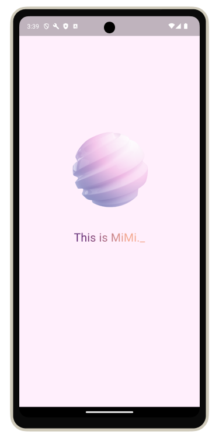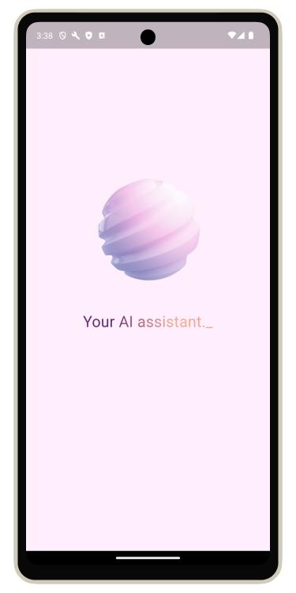


## Features

### Chat Mode

- **Question Answering**: Get accurate and contextual answers to queries across various domains using OpenAI's language models, such as ChatGPT.
- **Speech and Text Input**: Interact with MiMi using voice commands or typed questions for flexibility and convenience.
- **Writing Assistance**: Draft and edit copy faster with MiMi's help, including references and citations.
- **Programming Assistance**: Receive code snippets, logical explanations, and guidance in various programming languages.

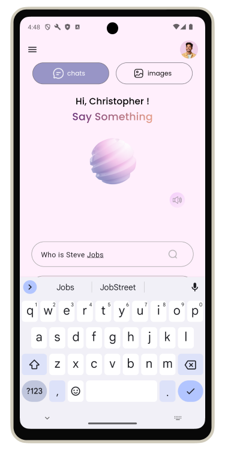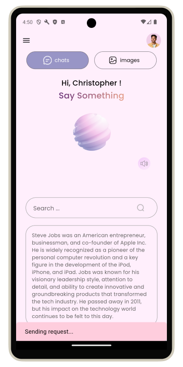

### Image Generation Mode

- **AI Image Creation**: Generate creative, high-quality images based on written descriptions or voice prompts using OpenAI's DALL-E and DALL-E 2 models.
- **Speech and Text Prompts**: Describe the desired image using voice commands or typed text for a hands-free or precise experience.

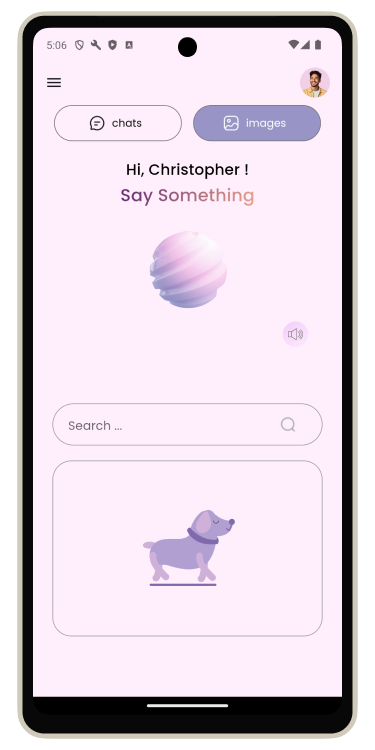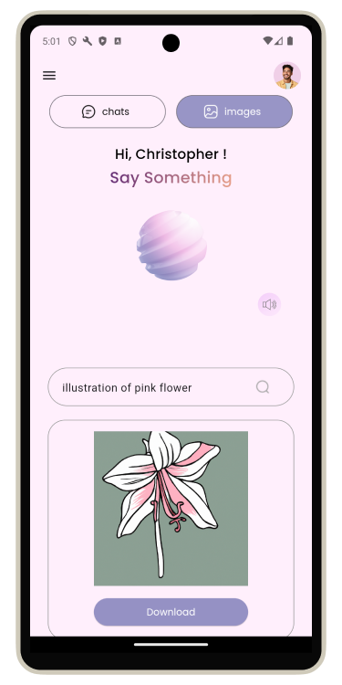

### User Management

- **Authentication**: Create an account using email and password, or sign in with an existing Google or Microsoft account.
- **User Profile**: Manage your profile, including avatar, username, and password.

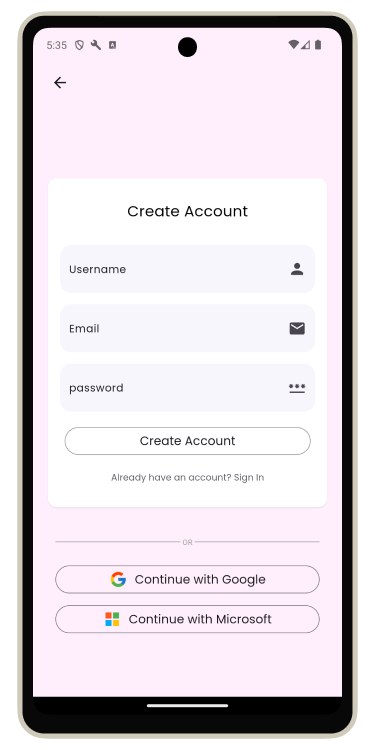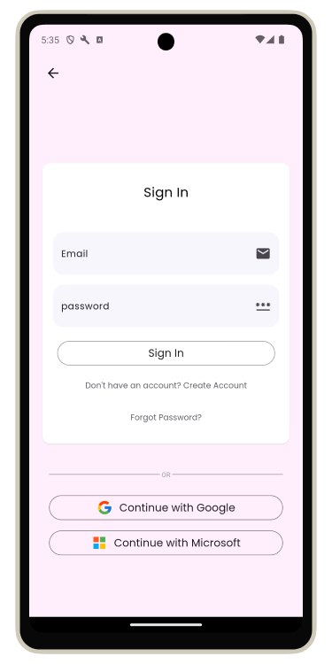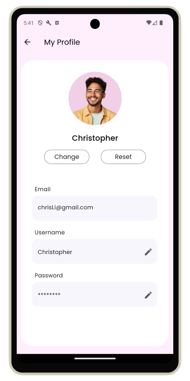

### User Interface

- **App Drawer**: Access different sections of the application through a modern navigation panel.
- **Notifications**: Stay informed with Snackbar, AlertDialog, and Toast notifications for status changes.
- **Animations**: Enjoy a delightful experience with interactive animations simulating conversations with MiMi.

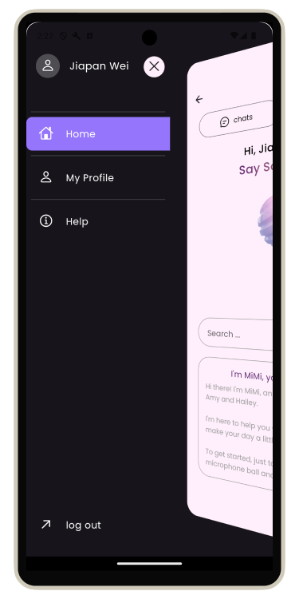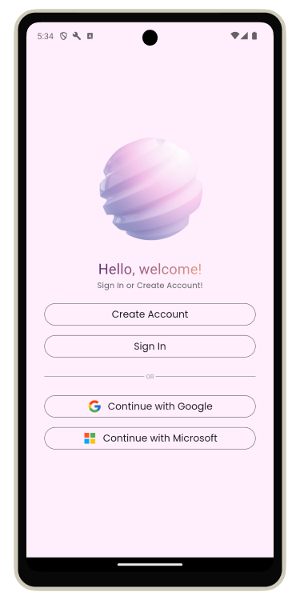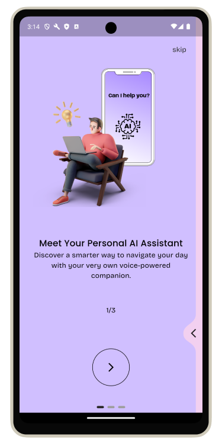

## Getting Started

```bash
# Clone the repository
git clone git@github.com:jiapanWei/voice_assistant.git

# Generate API Key
- add your API key in .env file
- flutter pub run build_runner build --delete-conflicting-outputs

# Install dependencies
flutter pub get

# Run the application
flutter run